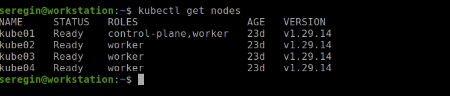
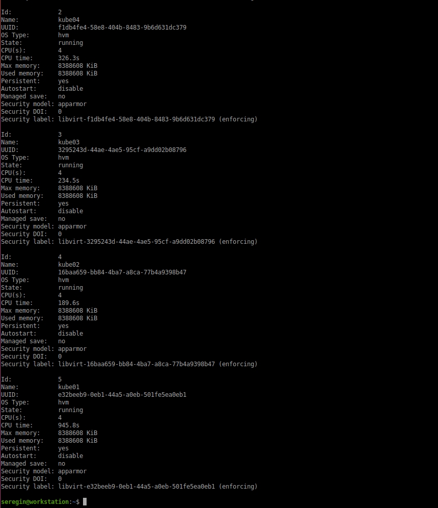
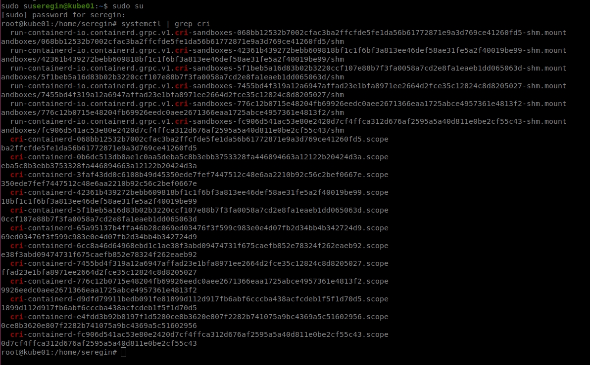
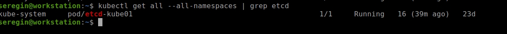
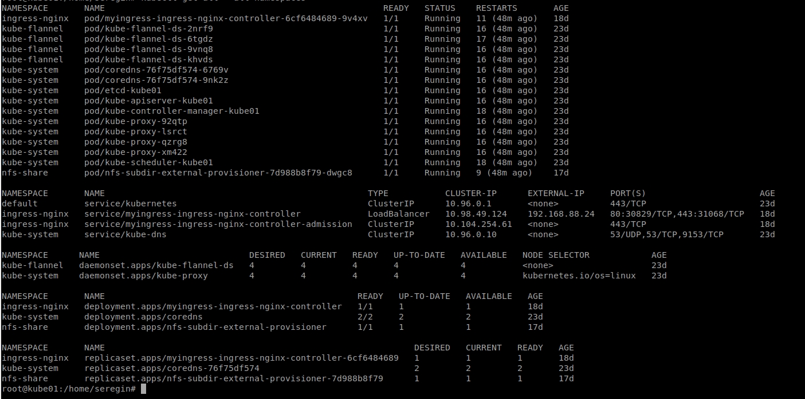

# Домашнее задание к занятию «Установка Kubernetes»

### Цель задания

Установить кластер K8s.

### Чеклист готовности к домашнему заданию

1. Развёрнутые ВМ с ОС Ubuntu 20.04-lts.


### Инструменты и дополнительные материалы, которые пригодятся для выполнения задания

1. [Инструкция по установке kubeadm](https://kubernetes.io/docs/setup/production-environment/tools/kubeadm/create-cluster-kubeadm/).
2. [Документация kubespray](https://kubespray.io/).

-----

### Задание 1. Установить кластер k8s с 1 master node

> 1. Подготовка работы кластера из 5 нод: 1 мастер и 4 рабочие ноды.

К счастью, я изначально поднял полноценный кластер через kubeadm, поэтому в целом у меня почти все готово сразу:

Список нод:



Список вм и характеристики:



> 2. В качестве CRI — containerd.



> 3. Запуск etcd производить на мастере.



> 4. Способ установки выбрать самостоятельно.

Ноды устанавливал через kubeadm. flannel - через kubectl



```
sudo kubeadm init --pod-network-cidr=10.244.0.0/16
kubectl apply -f https://raw.githubusercontent.com/coreos/flannel/master/Documentation/kube-flannel.yml
sudo kubectl label node kube02 node-role.kubernetes.io/worker=worker
sudo kubectl label node kube03 node-role.kubernetes.io/worker=worker
sudo kubectl label node kube04 node-role.kubernetes.io/worker=worker
sudo kubectl label node kube01 node-role.kubernetes.io/worker=worker
```

Ингресс-контроллер nginx и nfs-провижнер через helm:

```
helm upgrade --install myingress ingress-nginx/ingress-nginx --namespace ingress-nginx --values values.yml
helm install nfs-subdir-external-provisioner nfs-subdir-external-provisioner/nfs-subdir-external-provisioner     --set nfs.server="192.168.88.25"     --set nfs.path="/var/nfs_share" -n nfs-share

```

## Дополнительные задания (со звёздочкой)

**Настоятельно рекомендуем выполнять все задания под звёздочкой.** Их выполнение поможет глубже разобраться в материале.   
Задания под звёздочкой необязательные к выполнению и не повлияют на получение зачёта по этому домашнему заданию. 

------
### Задание 2*. Установить HA кластер

1. Установить кластер в режиме HA.
2. Использовать нечётное количество Master-node.
3. Для cluster ip использовать keepalived или другой способ.

### Правила приёма работы

1. Домашняя работа оформляется в своем Git-репозитории в файле README.md. Выполненное домашнее задание пришлите ссылкой на .md-файл в вашем репозитории.
2. Файл README.md должен содержать скриншоты вывода необходимых команд `kubectl get nodes`, а также скриншоты результатов.
3. Репозиторий должен содержать тексты манифестов или ссылки на них в файле README.md.
